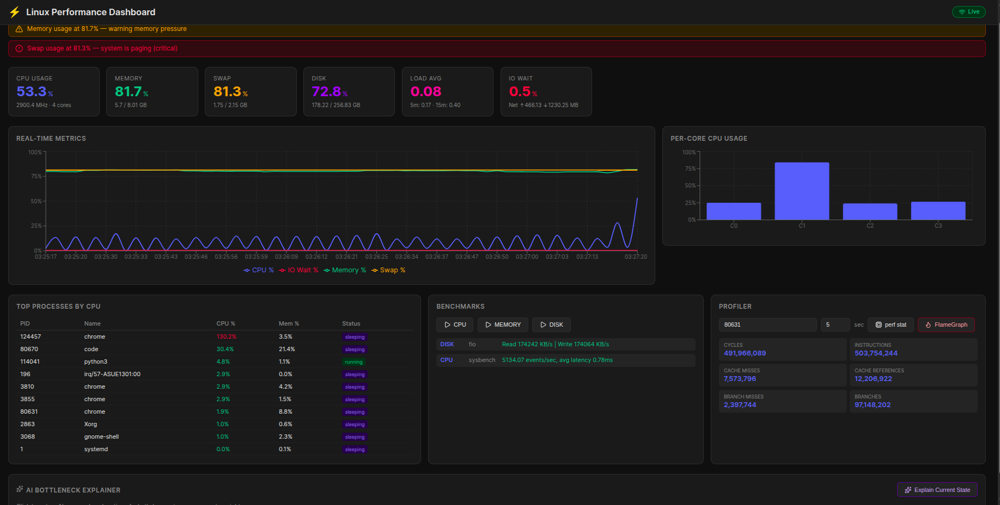

# Linux Performance Monitoring & Benchmark Dashboard

A full-stack, real-time Linux performance analysis system for performance engineers, SREs, and developers who need deep observability into their systems.

---

## What It Does

| Capability | Description |
|---|---|
| **Real-time monitoring** | CPU, memory, swap, disk, network, load average — live via WebSocket |
| **Per-core CPU view** | Bar chart of each CPU core's utilization |
| **Process inspector** | Top processes ranked by CPU usage, live |
| **Bottleneck detection** | Automatic analysis — flags CPU saturation, memory pressure, swap activity, IO wait, overload |
| **Benchmarking** | Trigger CPU / memory / disk benchmarks from the UI (sysbench + fio) |
| **Hardware profiling** | `perf stat` — CPU cycles, instructions, cache misses, branch misses |
| **Flame Graphs** | Full `perf` + FlameGraph SVG generation, embedded in the dashboard |
| **Historical data** | SQLite persistence — view metric history and past benchmark results |

---

## Quick Start

### Option A — Local (recommended)

```bash
# 1. One-time setup (installs tools, configures sudoers for perf)
bash scripts/setup.sh

# 2. Start backend
cd backend
source .venv/bin/activate
uvicorn app.main:app --reload

# 3. Start frontend (new terminal)
cd frontend
npm run dev
```

Open: http://localhost:5173

### Option B — Docker

```bash
docker compose up --build
```

> Docker uses `--privileged` + `pid: host` so `perf` works inside the container.

---

## sudoers Setup (for `perf`)

`perf` requires elevated privileges to read hardware counters. The setup script handles this automatically. To do it manually:

```bash
sudo visudo
# Add:
yourusername ALL=(ALL) NOPASSWD: /usr/bin/perf
```

---

## Dashboard Overview


---

## Project Structure

```
performance-monitoring-dashboard/
├── backend/
│   ├── app/
│   │   ├── main.py                   # FastAPI app, lifespan, CORS
│   │   ├── core/database.py          # SQLAlchemy async engine + session
│   │   ├── models/metrics.py         # DB models: MetricSnapshot, BenchmarkResult, BottleneckEvent
│   │   ├── collectors/system.py      # psutil + /proc collectors
│   │   ├── services/
│   │   │   ├── analyzer.py           # Bottleneck detection engine
│   │   │   ├── benchmark.py          # sysbench + fio runners
│   │   │   ├── profiler.py           # perf stat + FlameGraph generator
│   │   │   └── collector_task.py     # Background task: collect → SQLite every 5s
│   │   └── api/
│   │       ├── metrics.py            # GET /api/metrics/*
│   │       ├── benchmark.py          # POST /api/benchmark/*
│   │       ├── profiler.py           # POST /api/profiler/*
│   │       └── ws.py                 # WebSocket /ws/metrics
│   ├── requirements.txt
│   └── Dockerfile
├── frontend/
│   └── src/
│       ├── App.jsx                   # Root layout
│       ├── hooks/useMetrics.js       # WebSocket hook with auto-reconnect
│       ├── api/client.js             # fetch wrappers for REST endpoints
│       └── components/
│           ├── cards/                # StatCard, BottleneckAlert
│           ├── charts/               # MetricsChart (line), CpuCoresChart (bar)
│           └── panels/               # ProcessTable, BenchmarkPanel, ProfilerPanel
├── flamegraphs/                      # Generated SVG files served statically
├── scripts/setup.sh                  # One-time local setup script
├── docs/
│   ├── architecture.md               # System design and data flows
│   ├── api-reference.md              # Full API endpoint reference
│   ├── tools.md                      # Tool reference (perf, sysbench, fio, psutil)
│   ├── bottleneck-guide.md           # How to interpret bottleneck alerts
│   └── future-scope.md               # Planned features and AI/ML roadmap
└── docker-compose.yml
```

---

## Tech Stack

| Layer | Technology |
|---|---|
| Backend | Python 3.11, FastAPI, WebSockets |
| Metrics | psutil, /proc/stat, /proc/meminfo |
| Benchmarks | sysbench (CPU/memory), fio (disk) |
| Profiling | Linux perf, FlameGraph (Brendan Gregg) |
| Database | SQLite via SQLAlchemy async |
| Frontend | React 19, Vite, Recharts |
| Container | Docker, docker-compose |

---

## Docs

- [Architecture](docs/architecture.md) — system design, component diagram, data flows
- [API Reference](docs/api-reference.md) — all endpoints
- [Tool Reference](docs/tools.md) — perf, sysbench, fio, psutil
- [Bottleneck Guide](docs/bottleneck-guide.md) — how to interpret alerts
- [Future Scope](docs/future-scope.md) — planned features and AI/ML roadmap
